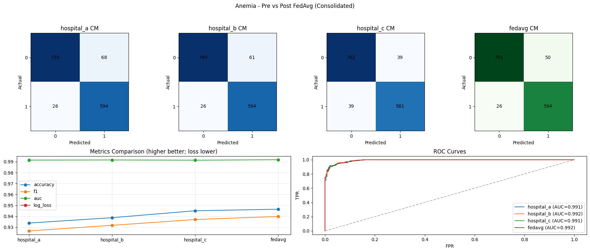
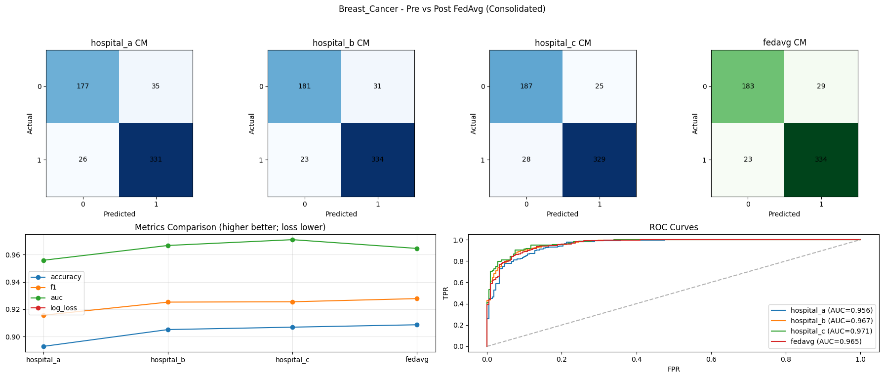
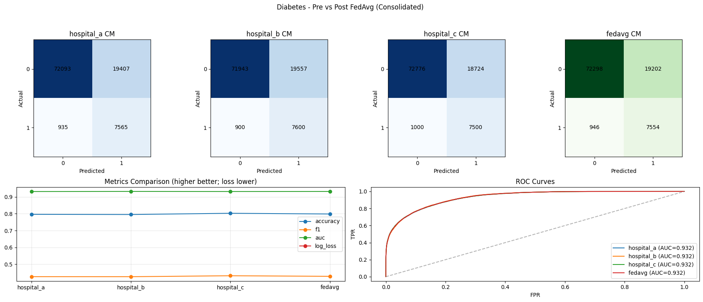
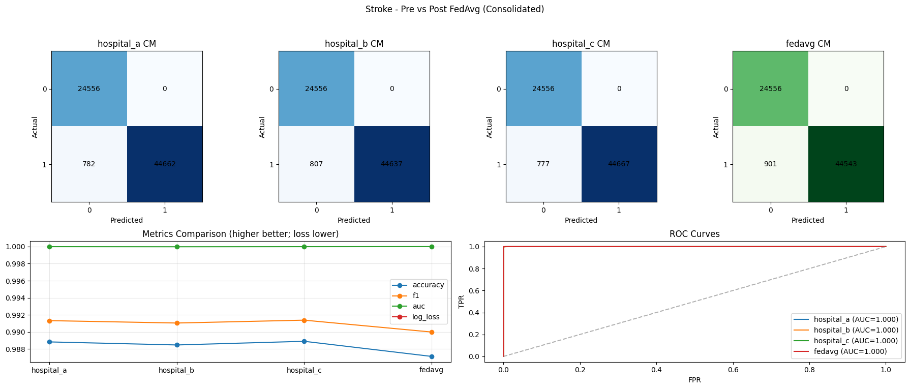

# 🏥 Health Analysis System using Federated Learning

A health risk prediction system that leverages **Federated Learning** to train models across multiple hospitals while maintaining data privacy. The system now uses **XGBoost (gblinear booster)** per hospital, exporting linear model weights (`coef`, `intercept`) to JSON, and applies **FedAvg** over these weights at prediction time. It provides a web interface for disease prediction, AI-powered health tips, and appointment management.

## ✨ Features

- **Multi-disease Prediction**: 4 diseases (Anemia, Breast Cancer, Diabetes, Stroke)
- **Federated Learning**: Privacy-preserving setup across 3 hospitals
  - **XGBoost (gblinear)**: Produces linear weights compatible with FedAvg
  - **FedAvg Aggregation**: Weighted by hospital sample counts when available (`num_samples`)
- **Web Application**: Modern UI with user authentication, prediction forms, and admin dashboard
- **AI Health Tips**: Google Gemini API integration for health advice chatbot
- **Appointment Management**: Contact form submissions with admin status tracking
- **SQLite Database**: Secure storage for user accounts and contact submissions

## 🚀 Quick Start

### Prerequisites

- Python 3.8+
- pip

### Installation

1. **Clone the repository**
   ```bash
   git clone <repository-url>
   cd Health-Analysis-using-Federated-Learning-and-Cloud
   ```

2. **Create virtual environment**
   ```bash
   python -m venv myenv
   # Windows
   .\myenv\Scripts\activate
   # Linux/Mac
   source myenv/bin/activate
   ```

3. **Install dependencies**
   ```bash
   pip install -r requirements.txt
   ```

4. **Set up environment variables**
   
   Create a `.env` file in the project root (or copy from `.env.example`):
   ```bash
   # Copy the example file
   cp .env.example .env
   ```
   
   Edit `.env` and add your API keys:
   ```env
   GEMINI_API_KEY=your-gemini-api-key-here
   FLASK_SECRET_KEY=your-secret-key-here
   ```
   
   > **Note**: The `.env` file is gitignored and will not be committed to version control.

5. **Prepare data and train models**
   ```bash
   # Split data for hospitals
   python backend/constants/split.py
   
   # Train XGBoost gblinear models per disease & hospital (saves *_weights.json)
   python backend/model/train_anemia.py
   python backend/model/train_breast_cancer.py
   python backend/model/train_diabetes.py
   python backend/model/train_stroke.py
   ```

6. **Run the application**
   ```bash
   python app.py
   ```
   Open browser: **http://127.0.0.1:5000**

## 📁 Project Structure

```
├── app.py                          # Main Flask application (FedAvg over weights)
├── database.py                     # SQLite database module for users & contacts
├── .env                            # Environment variables 
├── .env.example                    # Template for environment variables
├── backend/
│   ├── constants/
│   │   └── split.py               # Data splitting utility
│   ├── federated_learning/
│   │   └── fedavg_simulator.py    # FedAvg simulation (optional)
│   └── model/
│       └── train_*.py             # Model training scripts (XGBoost gblinear -> weights.json)
├── data/
│   ├── raw/                       # Raw CSV datasets
│   ├── hospital/                  # Hospital-split data
│   ├── weights/                   # Per-disease per-hospital *_weights.json
│   └── app.db                     # SQLite database (auto-created on first run)
├── static/
│   └── css/styles.css             # Global styles
├── templates/                      # HTML templates
└── requirements.txt                # Dependencies
```

## 🗄️ Database

The application uses SQLite for storing:

- **Users**: Email, password (hashed recommended for production), and role (user/admin)
- **Contacts**: Appointment submissions with status tracking

On first run, the database is automatically created at `data/app.db`. Existing JSON data from `users.json` and `contacts.json` is automatically migrated to SQLite.

## 🧠 Federated Learning

- Each hospital trains its own **XGBoost (gblinear)** model.
- We export linear parameters to JSON: `features`, `coef`, `intercept`, `classes`, and `num_samples`.
- At inference, the app loads all hospital weights and applies **FedAvg** weighted by `num_samples` when present (fallback: equal weights).
- Prediction uses the standard logistic function on the aggregated weights.

## 📊 Model Evaluation Results

The following visualizations show the performance comparison between individual hospital models (pre-FedAvg) and the aggregated federated model (post-FedAvg) for each disease:

### Anemia


### Breast Cancer


### Diabetes


### Stroke


Each figure includes:
- **Confusion Matrices**: For each hospital and the federated model
- **Metrics Comparison**: Accuracy, F1-score, AUC, and Log Loss
- **ROC Curves**: Comparison of model performance across hospitals

## 💡 Notes on Features and Forms

- Forms map to the feature list in `hospital_a_weights.json`. For Diabetes, `gender` and `smoking_history` are one-hot encoded to match training.
- If datasets/columns change, retrain so weights contain the updated `features` list; forms and inference will align automatically.

## 🔐 Security Notes

- **API Keys**: Store all API keys in the `.env` file, never commit them to version control
- **Passwords**: For production, implement password hashing (bcrypt recommended)
- **Session Secret**: Generate a strong random secret key for `FLASK_SECRET_KEY`

## 🛠️ Technology Stack

- **Backend**: Flask 3.0.2
- **Database**: SQLite (via Python's built-in sqlite3)
- **ML**: XGBoost (gblinear), scikit-learn, pandas, numpy
- **AI**: google-generativeai (Gemini API)
- **Frontend**: HTML5/CSS3, JavaScript
- **Environment**: python-dotenv for configuration management

## 📝 License

MIT License - see [LICENSE](LICENSE) file for details.
